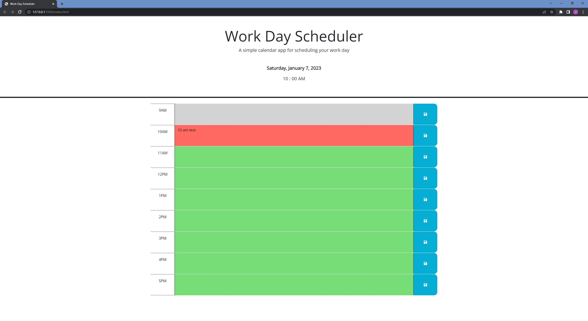

# Work Day Scheduler
## Description
The purpose of this project is to demonstrate my ability to work with third-party APIs in web development. This project is a Work Day Scheduler. When the user opens the web application, they are greeted with a simple, colorful representation of an 8 hour work-day. The current day is displayed at the top of the screen, and each hour has its own time block. The current timeblock is in red, past times are in gray, while future times are in green. When the user clicks on the a time block, they can enter a message or task, which can be saved by pressing the save icon on the right of the screen. These messages and tasks will persist in the browser until the user deletes them.

## Screenshot

## GitHub Pages Deployment
https://jeremystevens515.github.io/work-day-scheduler/